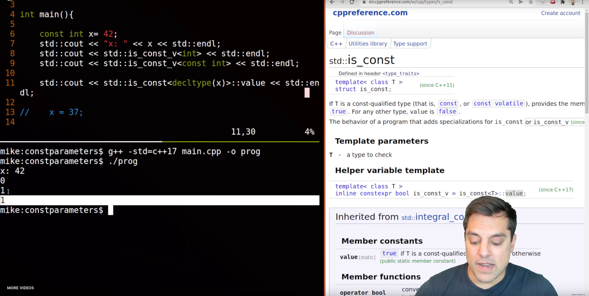

* Functions in C++ with const parameters and why bonus std is_const

* Functions in C++ with const parameters and why (bonus std::is_const)

std::is_const just checks if its const or not 

std::is_const_v is inline version