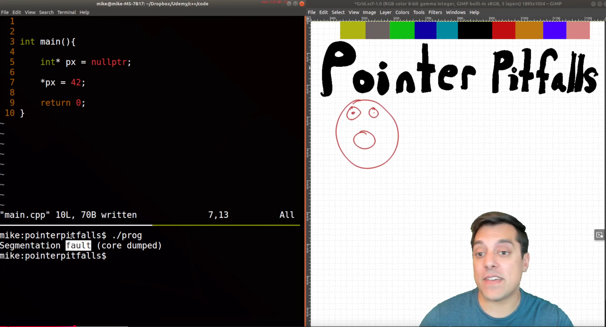
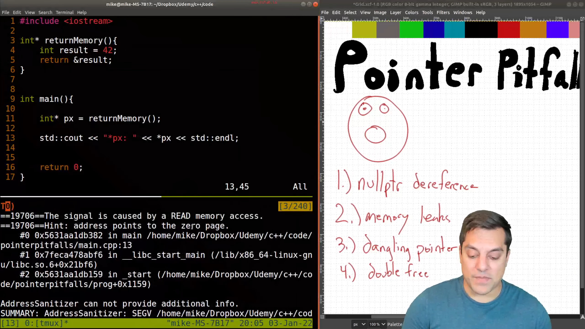

* Pitfalls of Pointers (and using address sanitizer and gdb to find them)

** Pitfall 1 - De-referencing

De-referencing nullptr

** Pitfall 2 - Memory leaks

Allocating and never freeing memory

** Pitfall 3 - Dangling pointer

** Pitfall 4 - Double free

2 pointers pointing to same thing and freeing same thing :) 