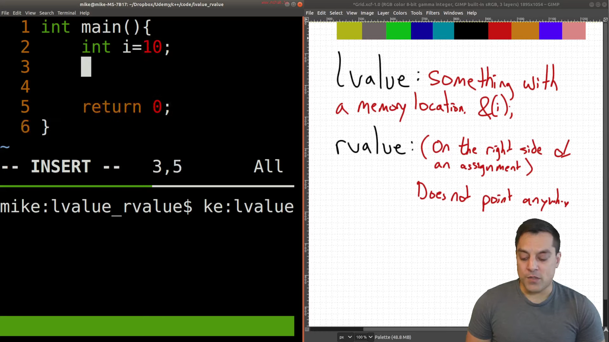
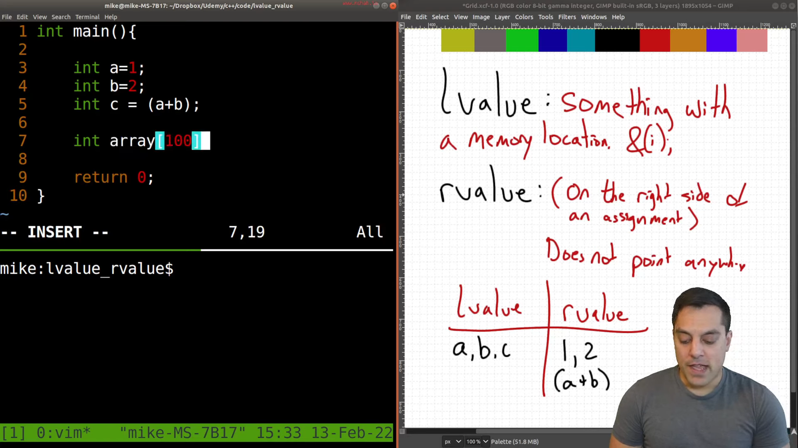
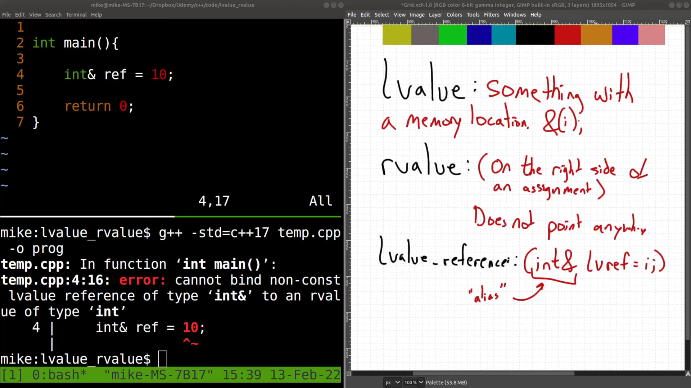
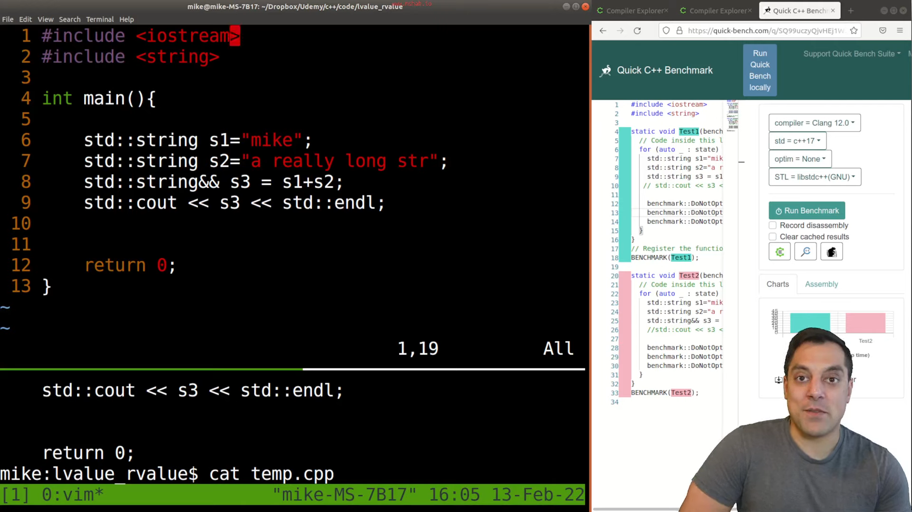
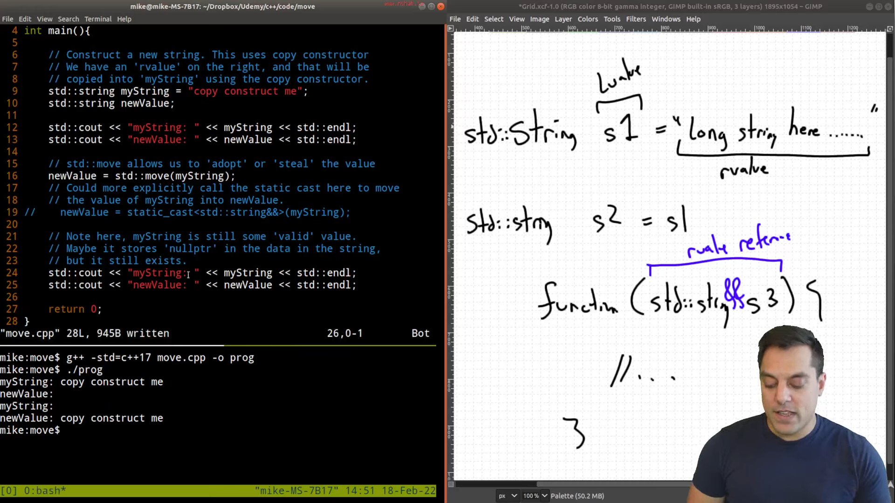
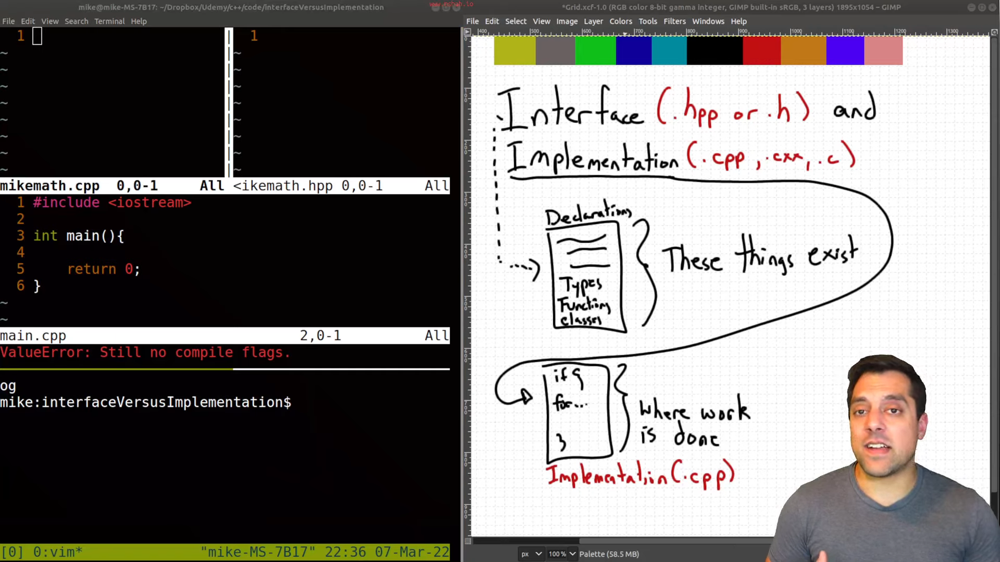
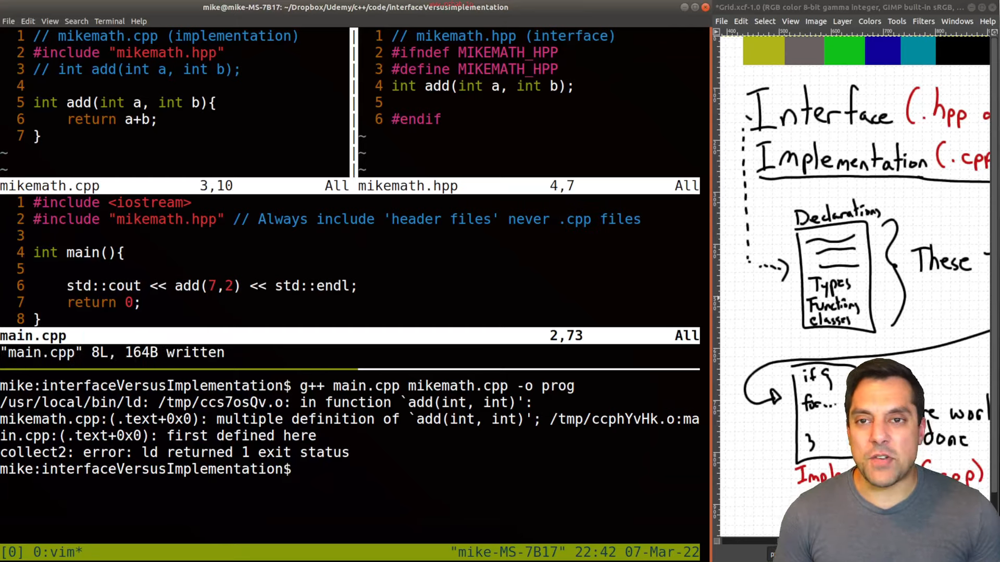

* Old Notes

* Level 2

* Lvalue and Rvalue

sometimes (a+b) is called xvalue (expiring value)

** Lvalue Reference

#+BEGIN_SRC cpp
const int& ref = 10; // works
int& ref = 10; // gives error
#+END_SRC
in const compiler creates a tmp var and equals it to 10

** Rvalue Reference

#+BEGIN_SRC cpp

std::string s3 = s1+s2; // will perform concat and then copies the value to s3
std::string&& s3 = s1+s2; // will just reference to the value of concat
#+END_SRC

* std::move or  the idea of move semantics

* Interface (.hpp) vs Implementation (.cpp)

