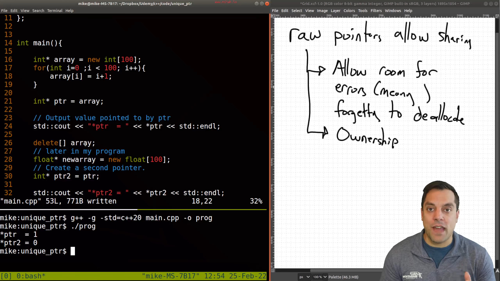
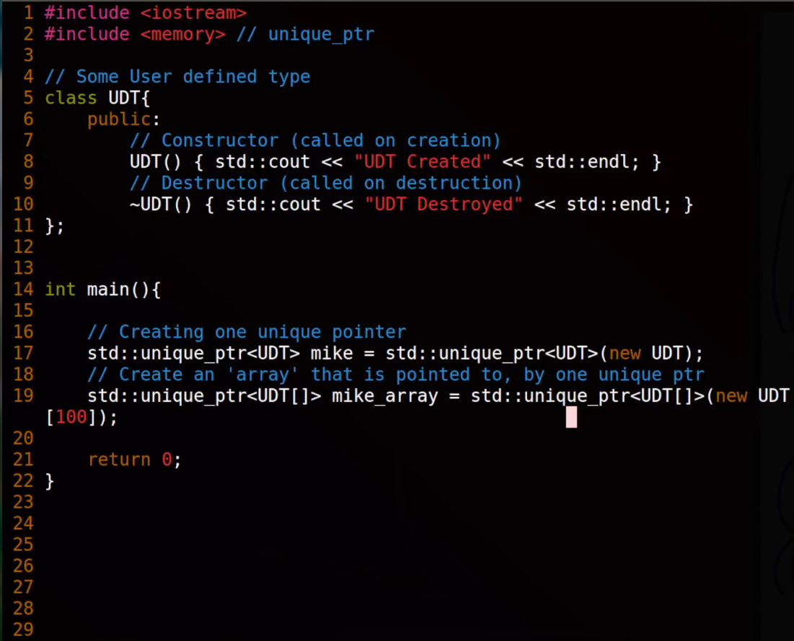
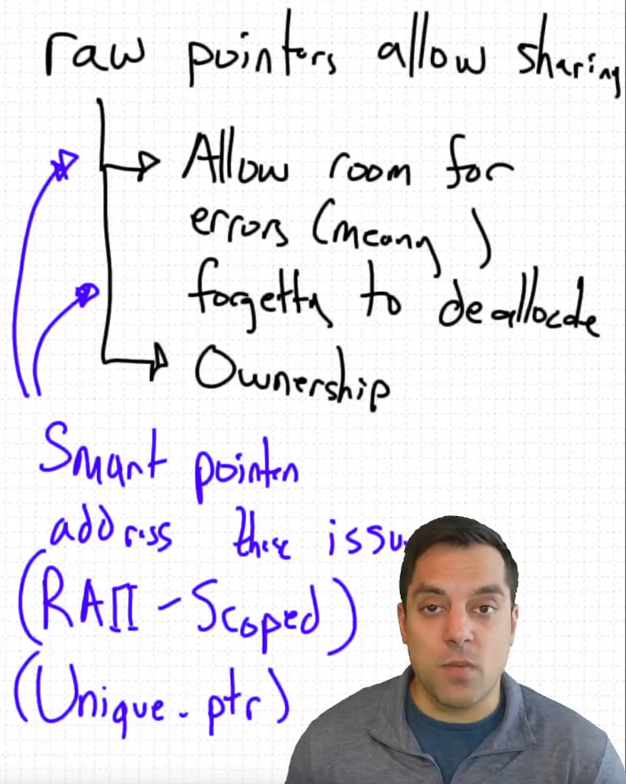
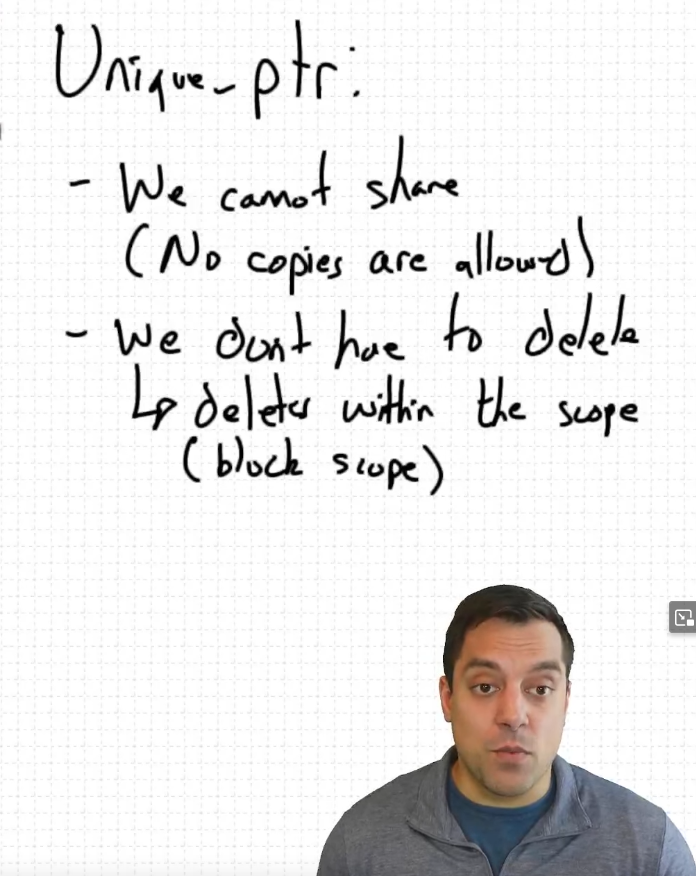

* std unique_ptr - A scoped smart pointer

* std::unique_ptr - A scoped smart pointer

** The Problems

\*ptr2 could have been something random as array is already deleted.

**Smart pointers solves all of this**

-- They delete themself once out of scope

