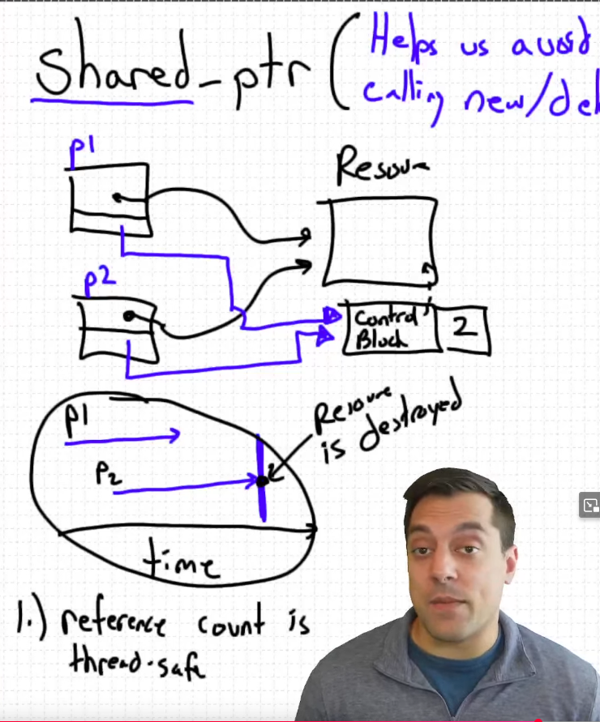

* std shared_ptr - A reference counted smart pointer

* std::shared_ptr - A reference counted smart pointer

If p1 and p2 are pointing to same resource 
The resource would only get deallocated when "all" pointers go out of scope and get destroyed
