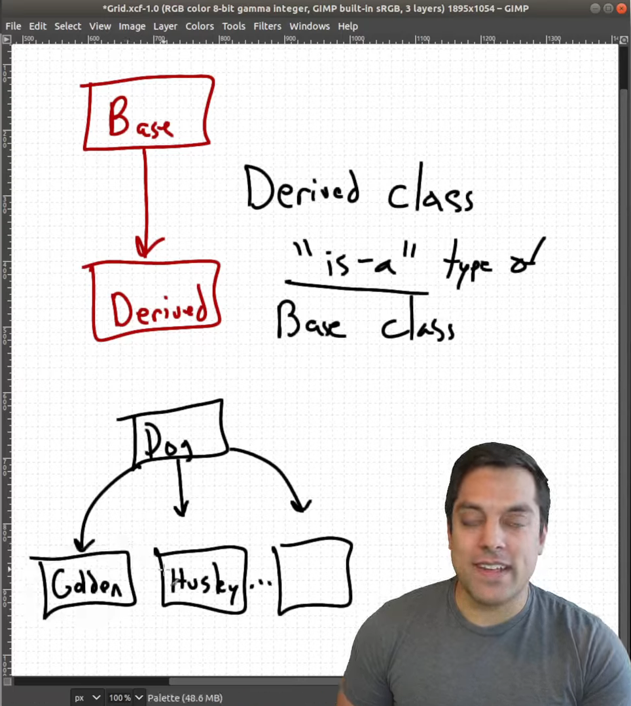
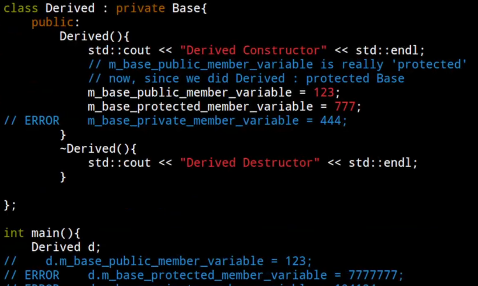

* Classes part 13 - Introduction to Inheritance

 protected vars can be only accessed by derived classes . Outside that they act like private members. 

Here for example if u derived it using private u can only access private var of the base class "outside" of the class (in implementation) 