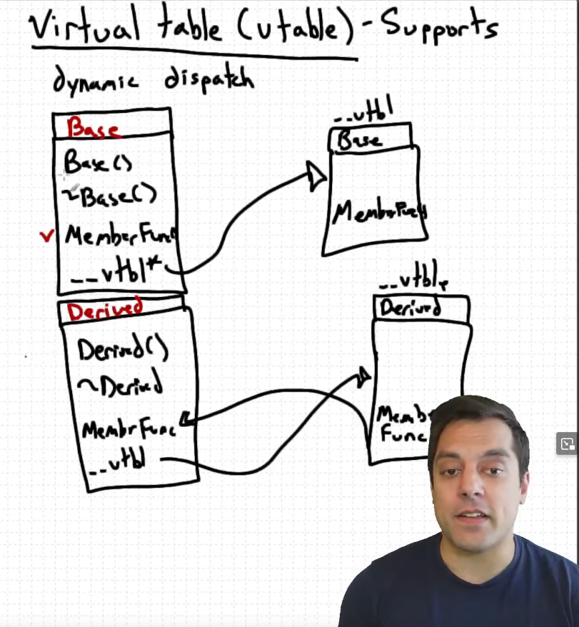
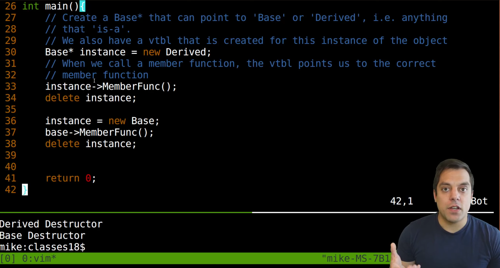

* Classes part 16 - Virtual Functions (Dynamic dispatch)

** Classes part 17 - Virtual Destructors (Make base class destructor virtual)

** Classes part 18 - Understanding the vtable (Popular interview question)

