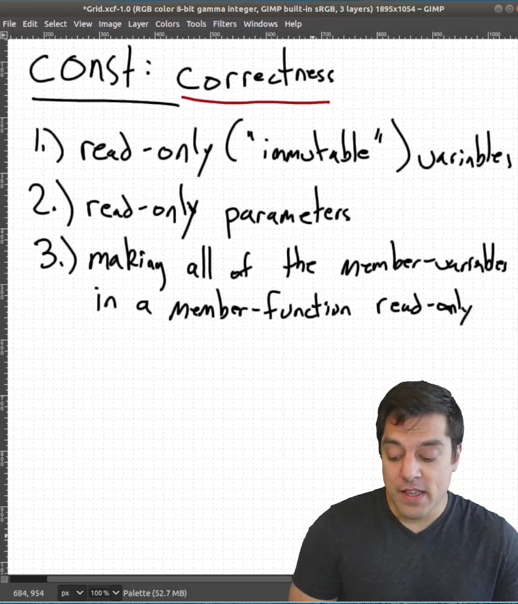

* Classes part 21 - ‘const correctness' with member functions

`void setvalue() const{}` the thing wt const would do is that any var cant be change in setvalue or in any other function inside setvalue which is trying to change any variable

