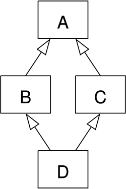

* Classes part 24 - Multiple Inheritance Revisited (Virtual inheritance)

https://en.wikipedia.org/wiki/Virtual_inheritance

"**Virtual inheritance** is a [[https://en.wikipedia.org/wiki/C%2B%2B "C++"][C++]] technique that ensures only one copy of a [[https://en.wikipedia.org/wiki/Base_class "Base class"][base class]]'s member variables are [[https://en.wikipedia.org/wiki/Inheritance_\(object-oriented_programming\][inherited]] "Inheritance (object-oriented programming)") by grandchild derived classes. Without"