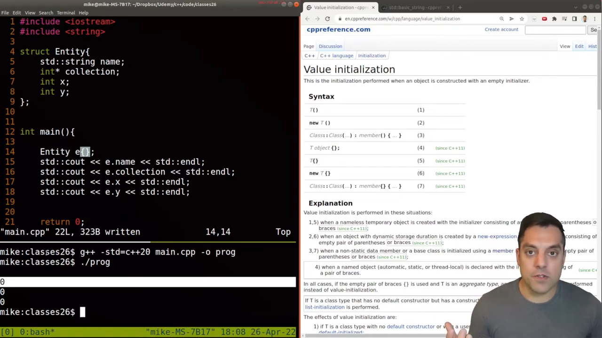
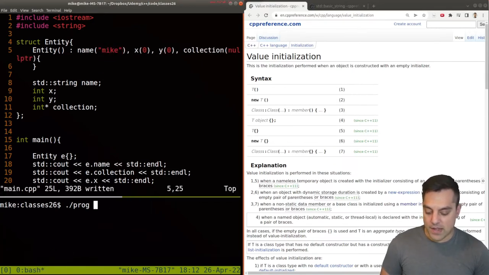
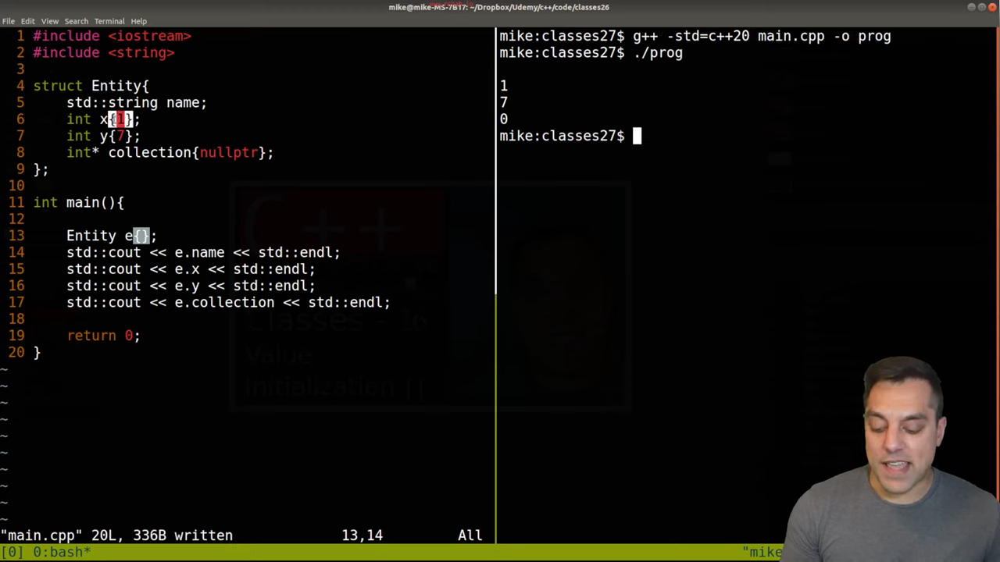
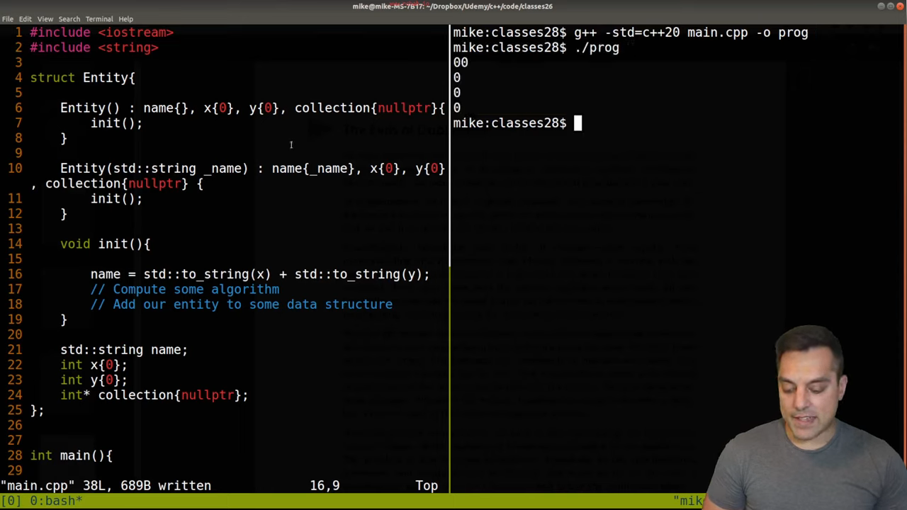
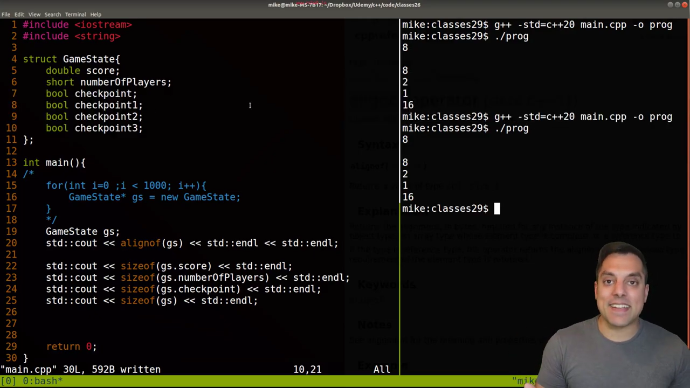
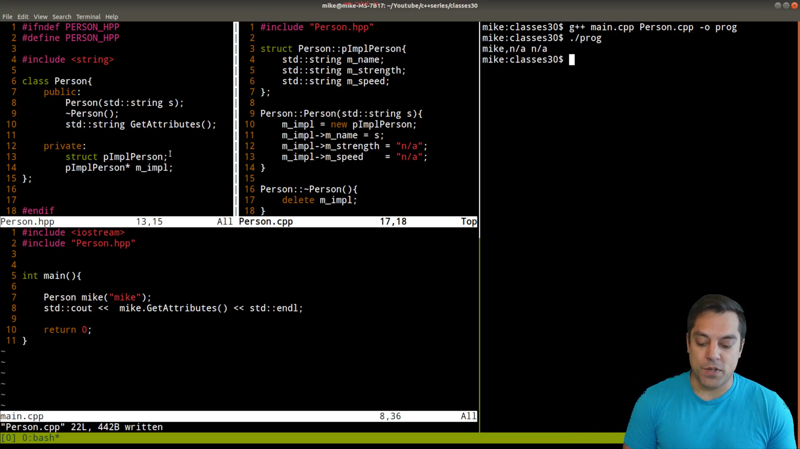

* Level 4

* Value Initialization (Zero-Initialization of Member Variables)

dosent work with constructors
[[file:./assets/Pasted-image-20241209214517.png]]

* ### In-Class Initializer

[[file:./assets/Pasted-image-20241210132142.png]]

* ###  Delegating Constructors

DRY = Dont repeat yourself

[[file:./assets/Pasted-image-20241210134125.png]]

Good:

[[file:./assets/Pasted-image-20241210134342.png]]

[[file:./assets/Pasted-image-20241210134515.png]]

* ### - Class Data Layout (Optimizing for size)

[[file:./assets/Pasted-image-20250106201457.png]]

* ###  pIMPL (pointer to implementation)

[[file:./assets/Pasted-image-20250106202531.png]]

[[file:./assets/Pasted-image-20250106203032.png]]
