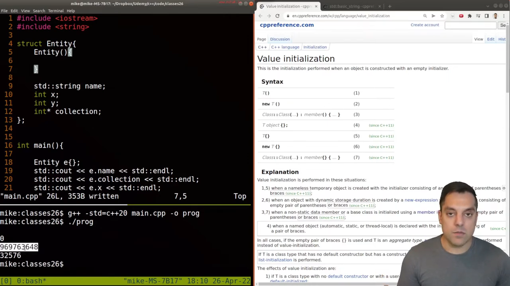
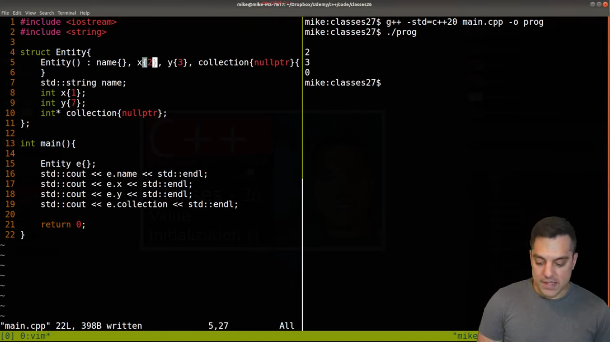
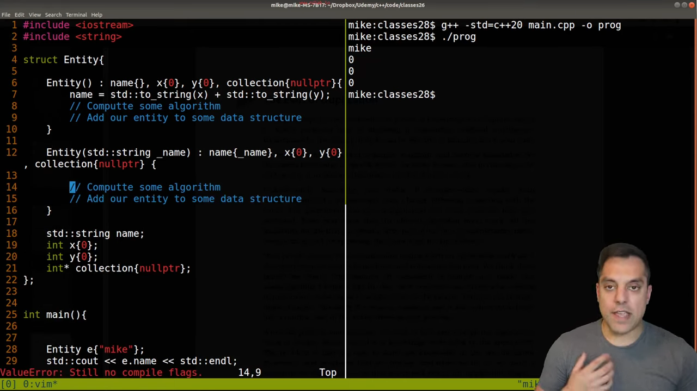
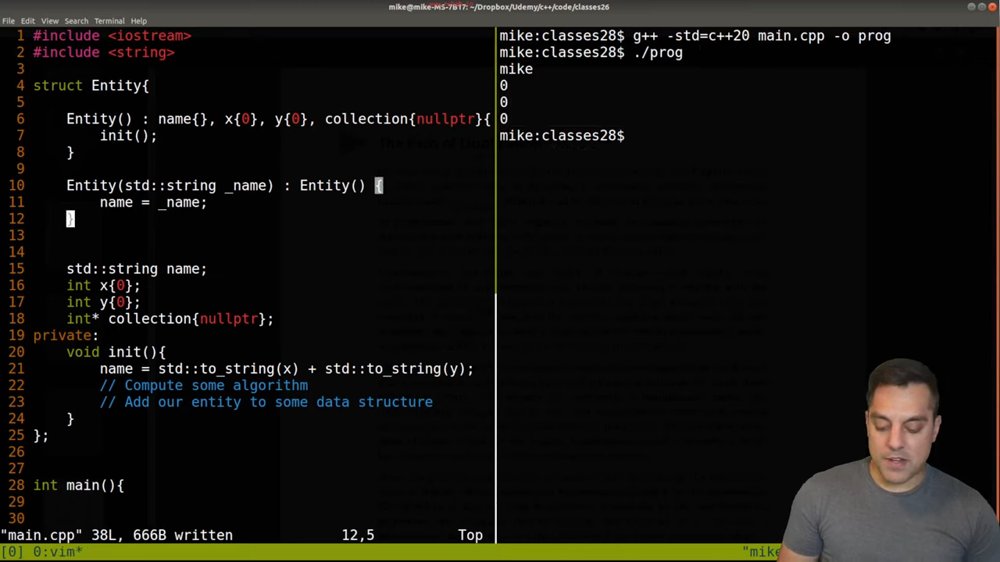
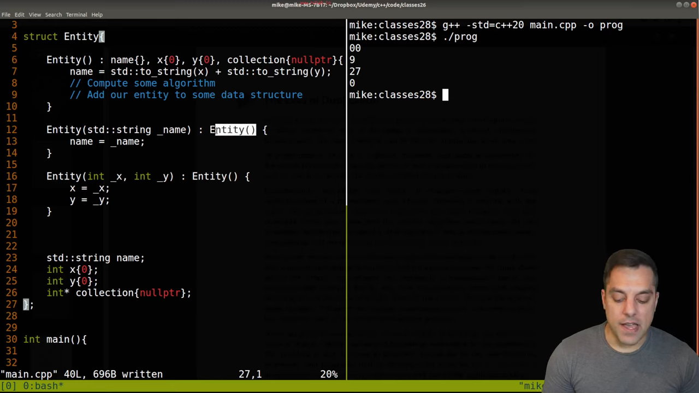
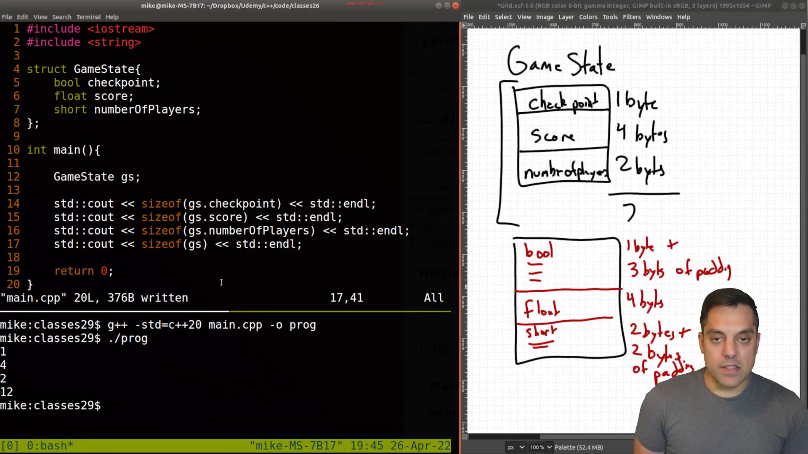
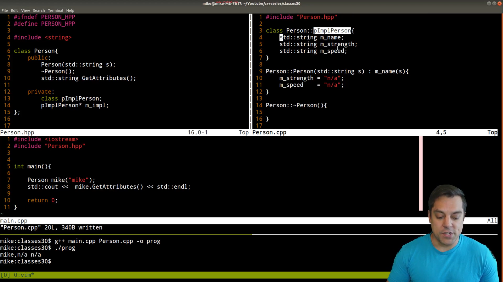
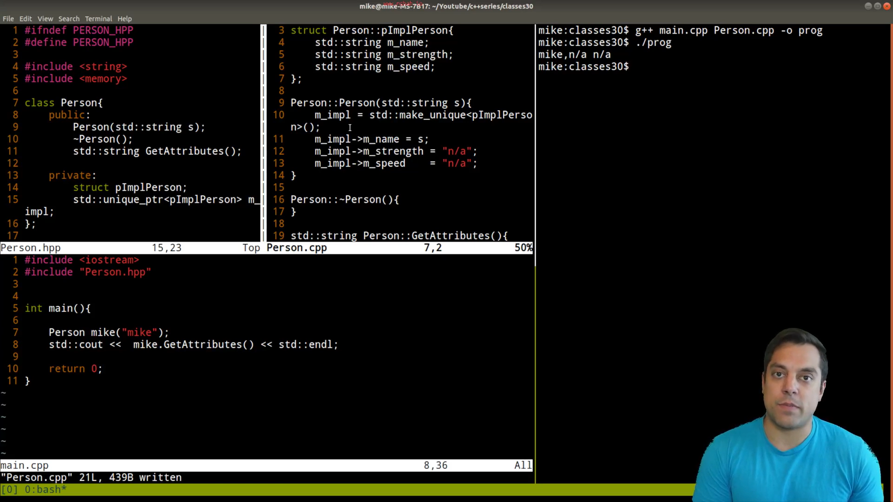

* Level 4

* Value Initialization (Zero-Initialization of Member Variables)

[[file:./assets/Pasted image 20241209214213.png][image]]

dosent work with constructors

[[file:./assets/Pasted image 20241209214723.png][image]]

* ### In-Class Initializer

[[file:./assets/Pasted image 20241210132049.png][image]]

* ###  Delegating Constructors

DRY = Dont repeat yourself

[[file:./assets/Pasted image 20241210134203.png][image]]

Good:

* ### - Class Data Layout (Optimizing for size)

[[file:./assets/Pasted image 20250106201953.png][image]]

* ###  pIMPL (pointer to implementation)

[[file:./assets/Pasted image 20250106202840.png][image]]

