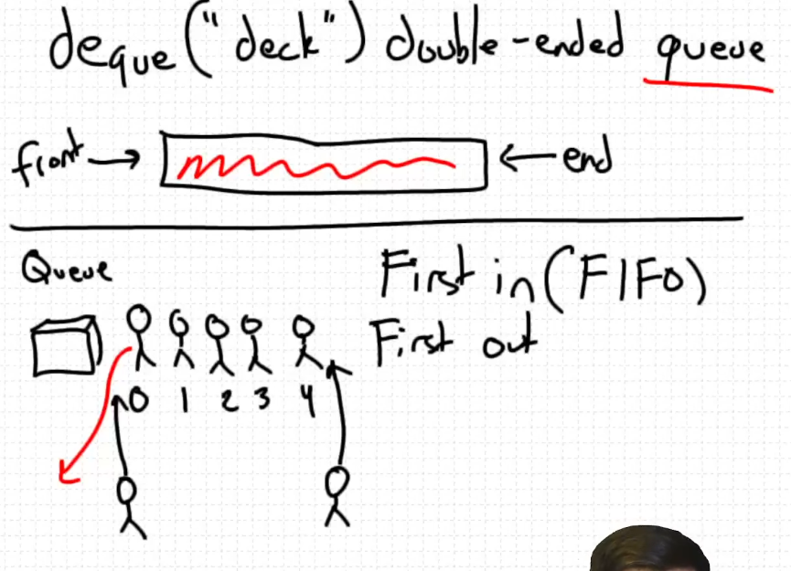
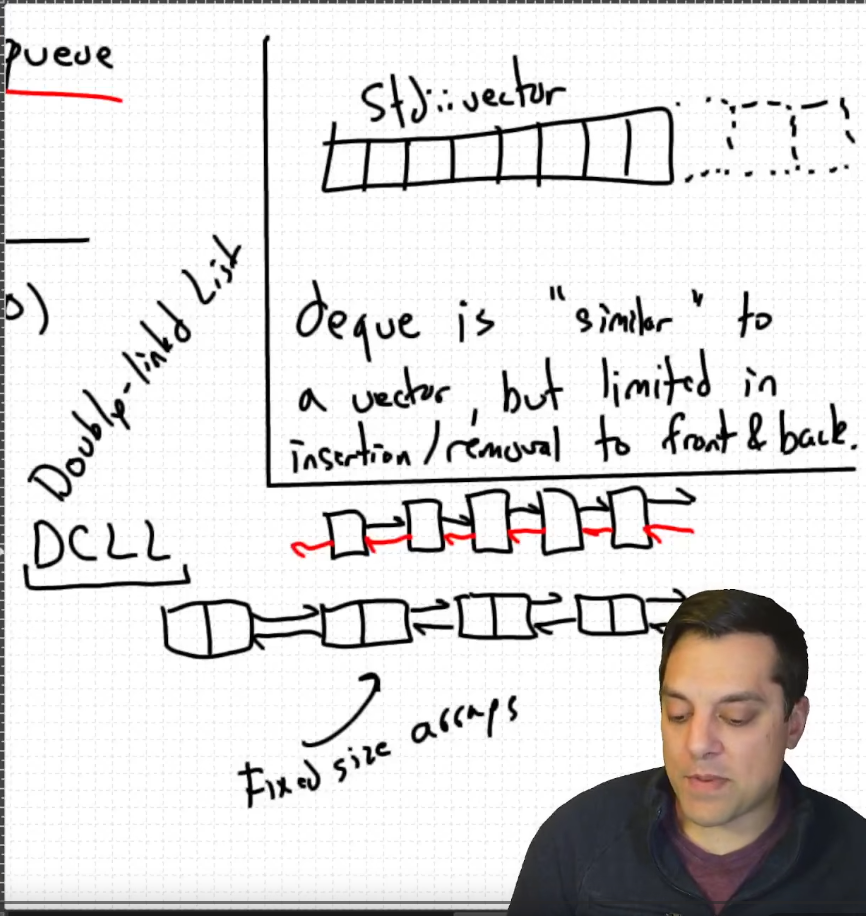
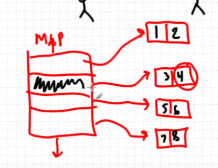

* STL std::deque
Double ended queue
FIFO
Extending it is very very efficent

#+BEGIN_FIGURE
#+CAPTION:
#+NAME: fig:2026-07-08-22-47-21
#+END_FIGURE

#+BEGIN_FIGURE
#+CAPTION:
#+NAME: fig:2026-07-08-22-58-57
#+END_FIGURE

The way how look up works in this is that it looks up into the map and then it deref to get the value at that pointer

#+BEGIN_FIGURE
#+CAPTION:
#+NAME: fig:2026-07-09-11-28-11
#+END_FIGURE
