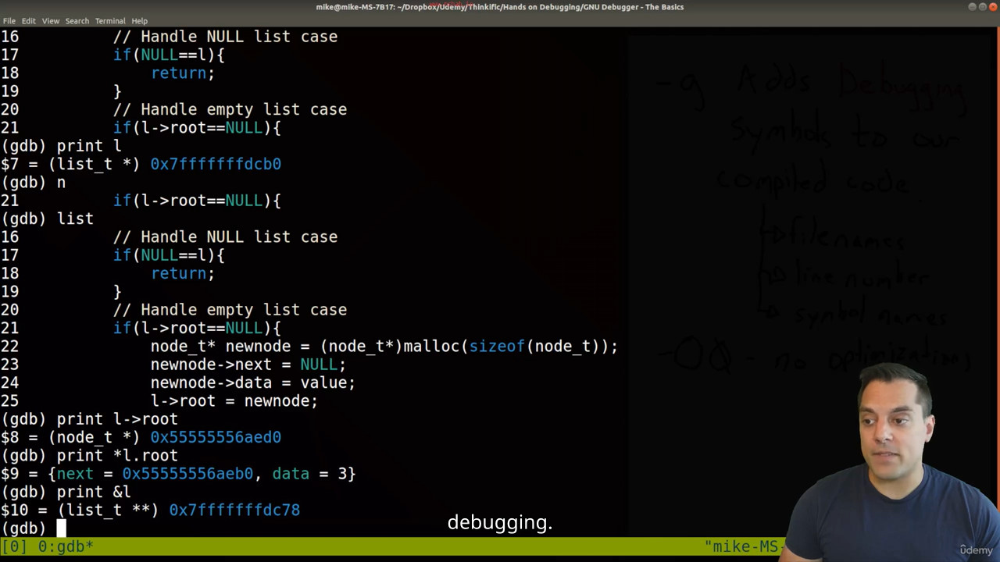

`#define DEBUG` debugging 

Add a flag -g in `g++ -g main.c -o main` to add debugging flags

Add a `-o0` to have no compiler optimisation 

## Commands

- start
- next - Run function
- step - Step into func
- list - Show code
- continue - Continue till termination

## 003 Printing Values and Listing Source Code

^ Print like refrence 

