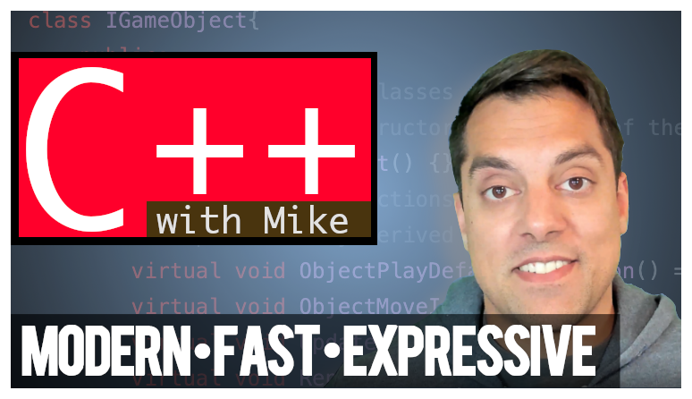
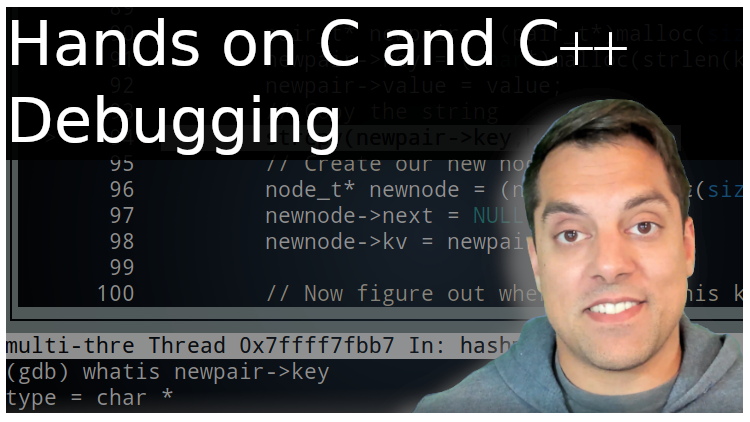
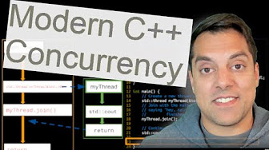

#+BEGIN_NOTE
To be opened in Org
#+END_NOTE
#+author: tr1x_em

* Index
** C++

Following Mike Shah's C++ playlist: [[https://www.youtube.com/playlist?list=PLvv0ScY6vfd8j-tlhYVPYgiIyXduu6m-L]]

** Debugging in GDB

Udemy course from Mike Shah : [[https://courses.mshah.io/]]

* Other Resources
- [[https://www.youtube.com/playlist?list=PLvv0ScY6vfd_ocTP2ZLicgqKnvq50OCXM][Modern C++ (cpp) Concurrency]]

  
